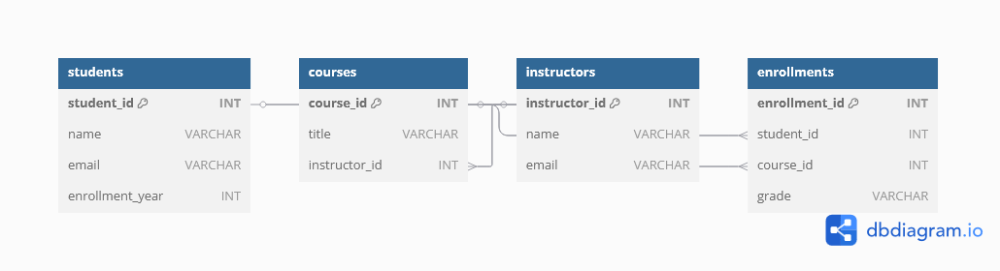

# Database-week-8-assignment

# 🎓 Student Records System

A simple Student Records Management API built with **FastAPI** and **MySQL**. This project demonstrates how to perform CRUD operations (Create, Read, Update, Delete) on a MySQL database using a modern web framework.

---

## 📌 Features

- 🚀 FastAPI for high-performance REST APIs
- 💾 MySQL for relational data storage
- 📚 Manage students: Add, view, update, and delete records
- 🔧 Swagger UI for easy API testing and documentation

---

## ERD Image

